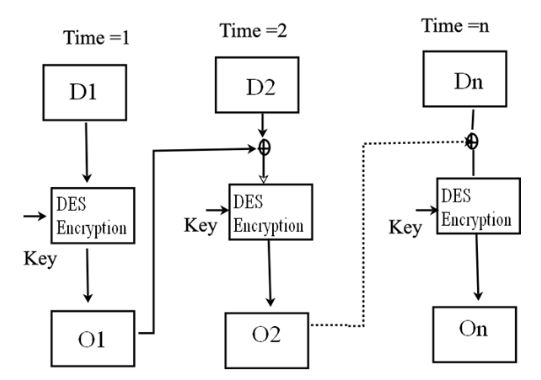

# Homework 5

## Problem 1

a. 
|Key Generation by Alice|    |
|---|---|
| Select p, q | p=3 & q=11
| Calculat n | n = 33 |
| Calculate $\phi$(n) | 20 |
| Select Integer e | gcd$(\phi(n), 7) = 1; 1<7<\phi(n)$
| Calculate d | 0.14285714285714285
| Public Key | PU = (7,33) |
| Private Key | PR = (0.14285714285714285,33) |

|Encryption by Bob with Alice's Public Key|    |
|---|---|
| Plaintext | M=5 < n=33 |
| Ciphertext | C=14; $C = M^e \mod n$ |

|Decryption By Alice with Alice's Public Key|    |
|---|---|
| Ciphertext: | C=14 |
| Plaintext: | M=5; $M = C^d \mod n$|
b.
|Key Generation by Alice|    |
|---|---|
| Select p, q | p=7 & q=11
| Calculat n | n = 77 |
| Calculate $\phi$(n) | 60 |
| Select Integer e | gcd$(\phi(n), 17) = 1; 1<17<\phi(n)$
| Calculate d | 0.058823529411764705
| Public Key | PU = (17,77) |
| Private Key | PR = (0.058823529411764705,77) |

|Encryption by Bob with Alice's Public Key|    |
|---|---|
| Plaintext | M=8 < n=77 |
| Ciphertext | C=57; $C = M^e \mod n$ |

|Decryption By Alice with Alice's Public Key|    |
|---|---|
| Ciphertext: | C=57 |
| Plaintext: | M=8; $M = C^d \mod n$|
c.
|Key Generation by Alice|    |
|---|---|
| Select p, q | p=11 & q=13
| Calculat n | n = 143 |
| Calculate $\phi$(n) | 120 |
| Select Integer e | gcd$(\phi(n), 9) = 1; 1<9<\phi(n)$
| Calculate d | 0.1111111111111111
| Public Key | PU = (9,143) |
| Private Key | PR = (0.1111111111111111,143) |

|Encryption by Bob with Alice's Public Key|    |
|---|---|
| Plaintext | M=7 < n=143 |
| Ciphertext | C=8; $C = M^e \mod n$ |

|Decryption By Alice with Alice's Public Key|    |
|---|---|
| Ciphertext: | C=8 |
| Plaintext: | M=7; $M = C^d \mod n$|
d.
|Key Generation by Alice|    |
|---|---|
| Select p, q | p=17 & q=31
| Calculat n | n = 527 |
| Calculate $\phi$(n) | 480 |
| Select Integer e | gcd$(\phi(n), 7) = 1; 1<7<\phi(n)$
| Calculate d | 0.14285714285714285
| Public Key | PU = (7,527) |
| Private Key | PR = (0.14285714285714285,527) |

|Encryption by Bob with Alice's Public Key|    |
|---|---|
| Plaintext | M=2 < n=527 |
| Ciphertext | C=128; $C = M^e \mod n$ |

|Decryption By Alice with Alice's Public Key|    |
|---|---|
| Ciphertext: | C=128 |
| Plaintext: | M=2; $M = C^d \mod n$|

## Problem 2

a.
$ M = C^{d} \mod n \\
C = 10; e = 5; n = 35 \\
M < n$
with this I Brute Forced M and found that M = 5.

b.
$e = 31 ; n = 3599 \\
d = e^{-1}mod \phi(n) \\
\phi(n) = (p-1)(q-1) 
$
Factors of e and n:
(1, 3599), (59, 61)

Using (59, 61) first (seems to be best choice)
$
\phi(n) = 3480 
$
Extended Euclidean Algorithm of gcd($\phi(n)$,e) = 1 where x = a and y = -449. 
y is the multiplicative inverse of e because e*y mod $\phi(n)$ = 1
Therefore d = -449
Thus the Private Key PR is
PR = {-449, 3599}

c. 

| i | 9 | 8 | 7 | 6 | 5 | 4 | 3 | 2 | 1 | 0 |
|---|----|---|---|---|---|---|---|---|---|---|
|$b_i$|1|0|0|1|0|1|0|1|0|0|
|c|1|2|4|9|18|37|74|149|298|596|
|f|5|25|625|937|595|569|453|591|59|1013|


## Problem 3

A. 
$
Y_a = 58 \\
Y_a = \alpha^{X_a} \mod q \\
Y_a = 7^4 \mod 71 \\
Y_a = 2401 \mod 71 \\
Y_a = 58
$

B. 
$
Y_b = 31 \\
Y_b = \alpha^{X_b} \mod q \\
Y_b = 7^{11} \mod 71 \\
Y_b = 1977326743 \mod 71 \\
Y_b = 31
$

C.
$
K = 24  \\
K = (Y_b)^{X_a} \mod q \\
K = (31)^4 \mod 71 \\
K = 923521 \mod 71 \\
K = 24
$

D. 
$2^{1} = 2^{0} \times 2 \equiv 1 \times 2 = 2 \equiv 1 (\mod 7)$
$2^{2} = 2^{1} \times 2 \equiv 2 \times 2 = 2 \equiv 2 (\mod 7)$
$2^{3} = 2^{2} \times 2 \equiv 4 \times 2 = 2 \equiv 4 (\mod 7)$
$2^{4} = 2^{3} \times 2 \equiv 8 \times 2 = 2 \equiv 8 (\mod 7)$
$2^{5} = 2^{4} \times 2 \equiv 16 \times 2 = 2 \equiv 5 (\mod 7)$
$2^{6} = 2^{5} \times 2 \equiv 32 \times 2 = 2 \equiv 10 (\mod 7)$
$2^{7} = 2^{6} \times 2 \equiv 64 \times 2 = 2 \equiv 9 (\mod 7)$
$2^{8} = 2^{7} \times 2 \equiv 128 \times 2 = 2 \equiv 7 (\mod 7)$
$2^{9} = 2^{8} \times 2 \equiv 256 \times 2 = 2 \equiv 3 (\mod 7)$
$2^{10} = 2^{9} \times 2 \equiv 512 \times 2 = 2 \equiv 6 (\mod 7)$
$2^{11} = 2^{10} \times 2 \equiv 1024 \times 2 = 2 \equiv 1 (\mod 7)$
Because the remainders in the period form a rearrangement of all nonzero remainders modulu 11, this implies that 2 is a primitive root of modulo 11.

E. 
The math looked complicated plus its mod q which is 11 so brute forcing should be easier than trying to calculate a way to solve for $X_A$ I wrote a simple script:
```py
def DerivePrivateKey(q, a, Y):
    # Brute Force Baby
    for i in range(20): #I figure since its mod 11 i dont need to go that high.
        if a**i %q == Y:
            return i
```
$X_A$ = 6

F.
Using the previous answer for $X_A$ I used the Shared Secret key formula:
$$ K  = Y_b^{X_a} \mod q $$

K = 3 

G.
The Diffie-Hellman is made such that if both public keys are derived, the messages would still remain fully encrypted. Though it is possible for the attack E to know K but to do so they would need to brute force q by creating a list of prime numbers, then test each prime number with each primitive root. This would be computationally impossible, within a human lifetime, to calculate if q is a large number.

H.
If the attacker has both public keys, the attacker is able to calculate their own Shared secret keys and forward that information to both parties (A and B). This allows the attack to intercept messages between two parties unknowingly which is referred to as a Man-in-The-Middle attack. Therefore, if an attack has both public keys they can launch a MITM attack.
## Problem 4

A. 
No, there could be an H(x) such that $H(x) = H(x')$ but to find such a pair would be computationally infeasible. Though it is collision-resistant collisions still occur but it is very difficult to find.

B.
Weak collision resistance is made through a one-way function and made such that  a given message $x_1$ it is hard to find a second message $x_2 \neq x_1$ with $H(x_1) = H(x_2)$. The hash is made to be as complex as possible which can be somewhat taxing on the system. Strong collision resistance takes less time to produce than weak collision resistance, it also ensures that obvious hash collisions do not exist. this makes Strong Collision resistance faster and better than weak collision resistance.

C.

## Problem 5

A.
Assume an array of sixteen 64-bit words W[0], ..., W[15], which will be treated as a circular queue. Define MASK as 00000000F in hex and round for t:
$
s = t^{MASK};
$
if $(t\leq 16)$ then
$W_s = W_s \oplus \sigma_0(W_{(s+1)^{MASK}}) \oplus W_{(s+9)^{MASK}}\oplus \sigma_1(W_{(s+14)^{MASK}})$

I also wrote a computer program in python that was a lot longer. 

B.
Because t is larger than 15 we know that the 16 buffer is already created so these $W_t$ can be calculated using the equation 
$$W_{t} = \sigma_1^{512}(W_{t-2})+W_{t-7}+ \sigma_0^{512}(W_{t-15}) + W_{t-16}$$
$W_{16} = \sigma_1^{512}(W_{14})+W_{9}+ \sigma_0^{512}(W_{1}) + W_{0}$
$W_{17} = \sigma_1^{512}(W_{15})+W_{10}+ \sigma_0^{512}(W_{2}) + W_{1}$
$W_{18} = \sigma_1^{512}(W_{16})+W_{11}+ \sigma_0^{512}(W_{3}) + W_{2}$
$W_{19} = \sigma_1^{512}(W_{17})+W_{12}+ \sigma_0^{512}(W_{4}) + W_{3}$

## Problem 6

A. 


B.

For one-block message, the MAC using CBC-MAC is T=MAC(K,X) where X is a message and K is a secret key. 
As for the two-block message in which the first block X and the second block $X \oplus T$. Therefore the MAC is given by: $$E(K(T\oplus(X\oplus T))) = E(K,X) = T$$

