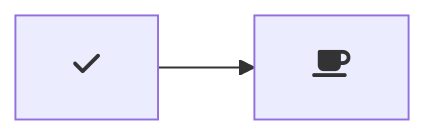

# Class Knotes

## Security vs Utility/Practicality

### Secure vs. Insecure can be a spectrum. 

1. A ssytem secure in every objections and purposes with zero vulnerabilities has no utility. The only truly secure system is one that isn't plugged in. 
2. We use systems which are imperfect in security and has known vulnerabilties and threats. A lot of things require people to be proactive and think about possible issues prior to them happening.
   - Example: Internet (Slide 23)
3. Assessing risk and balancing the tradeoff is important for example OTP MFA (Multi-Factor Authentication)

## Crypto Model 

### Some people use different info to relate to different topics

Alice -> Bob (legitimate)
Eve (Passive Eavesdropping)
Mallory (Active)

For alice and bob one has the information and the other does not, this is a common computer network context or data purposes. 

